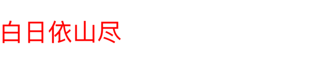
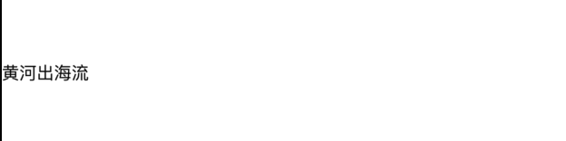
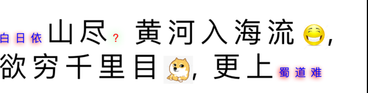
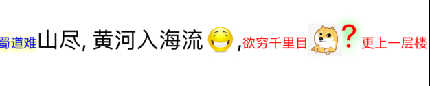

### 一个链式调用的富文本库, 可以很方便的生成富文本, 与 YYText 可以混合使用

#### 整体添加属性



```objc

- (void)testAddColorAndFont {
    NSString *str = @"白日依山尽";
    NSAttributedString *attr = str.builder.add(^(YPPSP *p) {
        p.key = NSFontAttributeName;
        p.value = [UIFont systemFontOfSize:30];
    }).add(^(YPPSP *p) {
        p.key = NSForegroundColorAttributeName;
        p.value = UIColor.redColor;
    }).build;
    // 此处也可以使用 UILabel
    YYLabel *label = [[YYLabel alloc] initWithFrame:CGRectMake(0, self.index ++ * LineHeight, UIScreen.mainScreen.bounds.size.width, LineHeight)];
    label.numberOfLines = 0;
    label.backgroundColor = UIColor.whiteColor;
    [self.view addSubview:label];
    label.attributedText = attr;
}
```

#### 支持文本替换, 正则替换, 可以自定义替换的内容, 可以很方便的插入图片, 文本编辑器的神兵利器



```objc
- (void)testReplace {
    NSString *str = @"黄河入海流";
    NSAttributedString *attr = str.builder.every(^(YPPDP *p) {
        p.regex = @"入";
        p.replace = ^NSAttributedString *(NSTextCheckingResult *result, NSInteger index, NSString *processingString) {
            return YPPAttr(@"出");
        };
    }).build;

    YYLabel *label = [[YYLabel alloc] initWithFrame:CGRectMake(0, self.index ++ * LineHeight, UIScreen.mainScreen.bounds.size.width, LineHeight)];
    label.numberOfLines = 0;
    [self.view addSubview:label];
    label.attributedText = attr;
}
```



一个从字符串构建的复杂的例子

```objc
- (void)testString {
    NSString *str = @"一层楼山尽, 黄河入海流[laugh], 欲穷千里目[dog], 更上一层楼";
    NSAttributedString *attr =
    str.builder.add(^(YPPSP *p) {
        p.key = NSFontAttributeName;
        p.value = [UIFont systemFontOfSize:30];
    }).every(^(YPPDP *p) {
        p.regex = @"一层楼";
        p.replace = ^NSAttributedString *(NSTextCheckingResult * result, NSInteger index, NSString * processingString) {
            return (index == 0 ? @"白日依" : @"蜀道难").builder.add(^(YPPSP *sp) {
                sp.key = NSForegroundColorAttributeName;
                sp.value = UIColor.blueColor;
            }).add(^(YPPSP *sp) {
                sp.key = NSShadowAttributeName;
                NSShadow *shadow = [[NSShadow alloc] init];
                shadow.shadowOffset = CGSizeMake(-1, 1);
                shadow.shadowBlurRadius = 5;
                shadow.shadowColor = UIColor.redColor;
                sp.value = shadow;
            }).build;
        };
    }).every(^(YPPDP *p) {
        p.regex = @",";
        p.range = NSMakeRange(3, 10);
        p.replace = ^NSAttributedString *(NSTextCheckingResult *result, NSInteger index, NSString * processingString) {
            NSMutableAttributedString *str = [[NSMutableAttributedString alloc] initWithString:@"?"];
            str.yy_color = UIColor.redColor;
            NSShadow *shadow = [[NSShadow alloc] init];
            shadow.shadowOffset = CGSizeMake(-1, 1);
            shadow.shadowBlurRadius = 10;
            shadow.shadowColor = UIColor.greenColor;
            str.yy_shadow = shadow;
            return str;
        };
    }).every(^(YPPDP *p) {
        p.regex = @"\\[\\w+?\\]";
        p.replace = ^NSAttributedString *(NSTextCheckingResult *result, NSInteger index, NSString * processingString) {
            NSString *emojiStr = [processingString substringWithRange:result.range];
            UIImageView *emojiPic = [[UIImageView alloc] initWithImage:[UIImage imageNamed:emojiStr]];
            NSAttributedString *emojiAttr = [NSAttributedString yy_attachmentStringWithContent:emojiPic
                                                                                   contentMode:UIViewContentModeScaleAspectFill
                                                                                attachmentSize:CGSizeMake(30, 30)
                                                                                   alignToFont:[UIFont systemFontOfSize:20]
                                                                                     alignment:YYTextVerticalAlignmentCenter];
            return emojiAttr;
        };
    }).add(^(YPPSP *p) {
        p.key = NSKernAttributeName;
        p.value = @(5);
    }).build;

    YYLabel *label = [[YYLabel alloc] initWithFrame:CGRectMake(0, self.index ++ * LineHeight, UIScreen.mainScreen.bounds.size.width, LineHeight)];
    label.numberOfLines = 0;
    label.backgroundColor = UIColor.whiteColor;
    [self.view addSubview:label];
    label.attributedText = attr;
}

```

#### 也支持对富文本直接操作, 比如各自处理后拼接, 再统一替换, 插入图片



```objc
- (void)testAppend {
    NSAttributedString *attr1 = YPPAttr( @"一层楼山尽, 黄河入海流[laugh],");
    NSAttributedString *attr2 = YPPAttr(@"欲穷千里目[dog], 更上一层楼");
    NSAttributedString *attr =
    attr1.builder.add(^(YPPSP *p) {
        p.key = NSFontAttributeName;
        p.value = [UIFont systemFontOfSize:20];
    }).every(^(YPPDP *p) {
        p.regex = @"一层楼";
        p.replace = ^NSAttributedString *(NSTextCheckingResult *result, NSInteger index, NSString *processingString) {
            return @"蜀道难".builder.add(^(YPPSP *sp) {
                sp.key = NSForegroundColorAttributeName;
                sp.value = UIColor.blueColor;
            }).add(^(YPPSP *sp) {
                sp.key = NSShadowAttributeName;
                NSShadow *shadow = [[NSShadow alloc] init];
                shadow.shadowOffset = CGSizeMake(-1, 1);
                shadow.shadowBlurRadius = 5;
                shadow.shadowColor = UIColor.yellowColor;
                sp.value = shadow;
            }).build;
        };
    }).append(attr2.builder.every(^(YPPDP *p) {
        p.regex = @",";
        p.range = NSMakeRange(3, 10);
        p.replace = ^NSAttributedString *(NSTextCheckingResult *result, NSInteger index, NSString *processingString) {
            NSMutableAttributedString *str = [[NSMutableAttributedString alloc] initWithString:@"?"];
            str.yy_color = UIColor.redColor;
            NSShadow *shadow = [[NSShadow alloc] init];
            shadow.shadowOffset = CGSizeMake(-1, 1);
            shadow.shadowBlurRadius = 10;
            shadow.shadowColor = UIColor.greenColor;
            str.yy_shadow = shadow;
            str.yy_font = [UIFont systemFontOfSize:30];
            return str;
        };
    }).add(^(YPPSP *p) {
        p.key = NSForegroundColorAttributeName;
        p.value = UIColor.redColor;
    }).build).every(^(YPPDP *p) {
        p.regex = @"\\[\\w+?\\]";
        p.replace = ^NSAttributedString *(NSTextCheckingResult *result, NSInteger index, NSString *processingString) {
            NSString *emojiStr = [processingString substringWithRange:result.range];
            UIImageView *emojiPic = [[UIImageView alloc] initWithImage:[UIImage imageNamed:emojiStr]];
            NSAttributedString *emojiAttr = [NSAttributedString yy_attachmentStringWithContent:emojiPic
                                                                                   contentMode:UIViewContentModeScaleAspectFill
                                                                                attachmentSize:CGSizeMake(30, 30)
                                                                                   alignToFont:[UIFont systemFontOfSize:20]
                                                                                     alignment:YYTextVerticalAlignmentCenter];
            return emojiAttr;
        };
    }).build;

    YYLabel *label = [[YYLabel alloc] initWithFrame:CGRectMake(0, self.index ++ * LineHeight, UIScreen.mainScreen.bounds.size.width, LineHeight)];
    label.numberOfLines = 0;
    label.backgroundColor = UIColor.whiteColor;
    [self.view addSubview:label];
    label.attributedText = attr;
}
```
